

    <h1><b>Implicit Reasoning in Large Language Models: A Comprehensive Survey</b></h1>

The official GitHub page for the survey paper "Implicit Reasoning in Large Language Models: A Comprehensive Survey".

 

    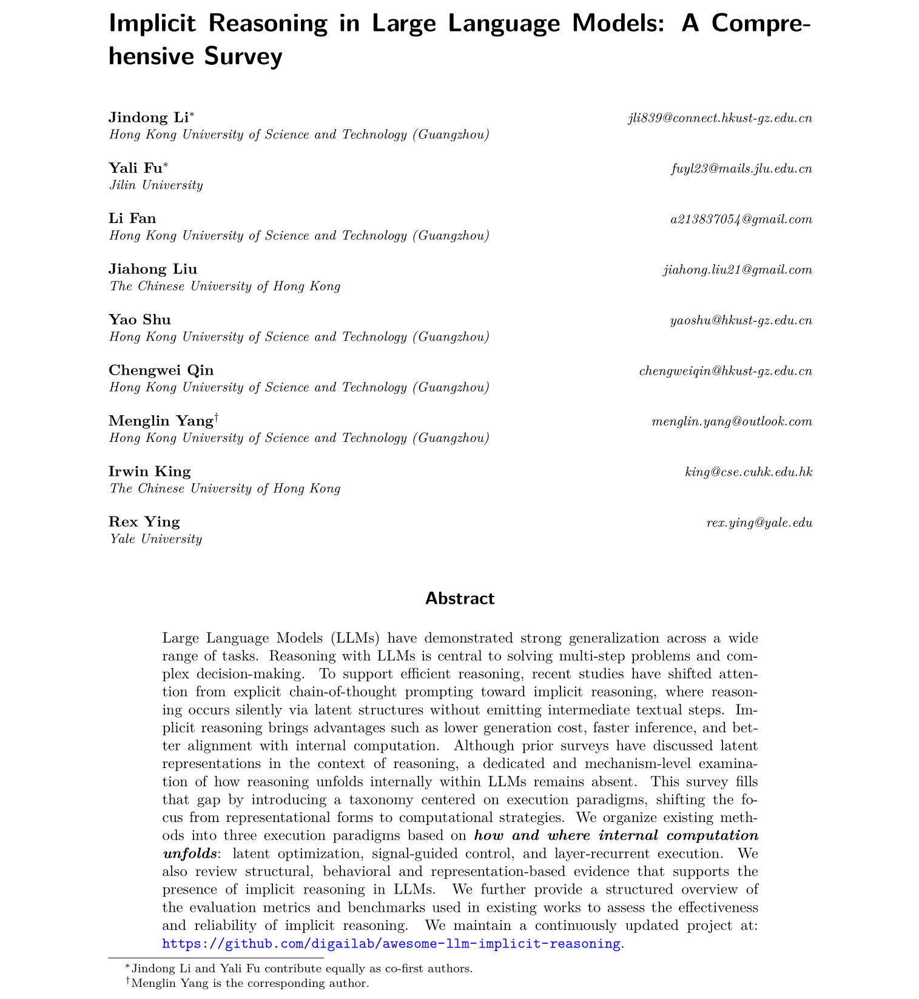

 

## 1. Introduction

    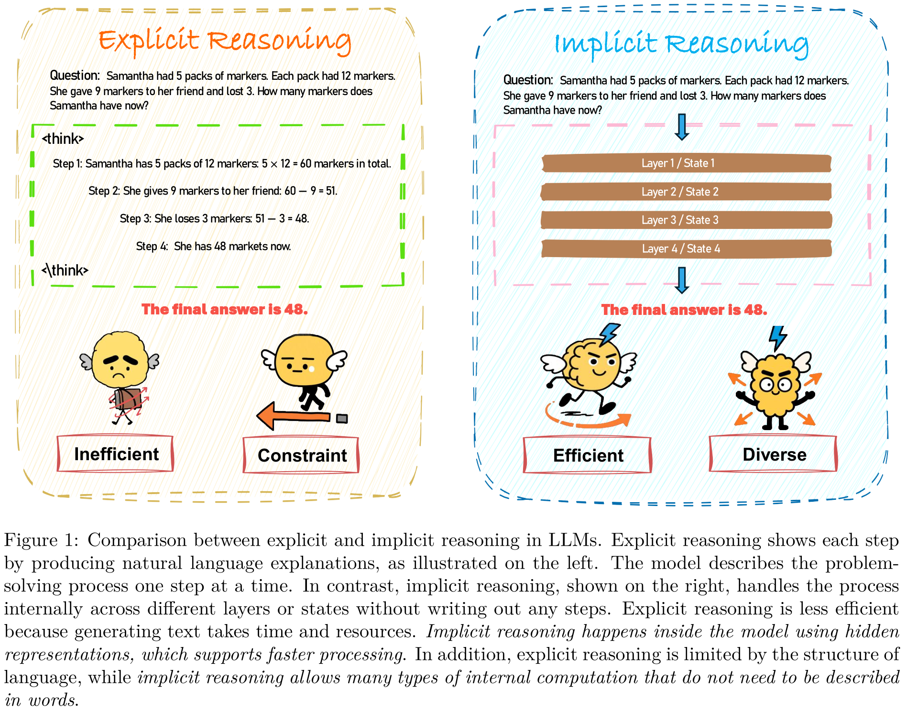

 

    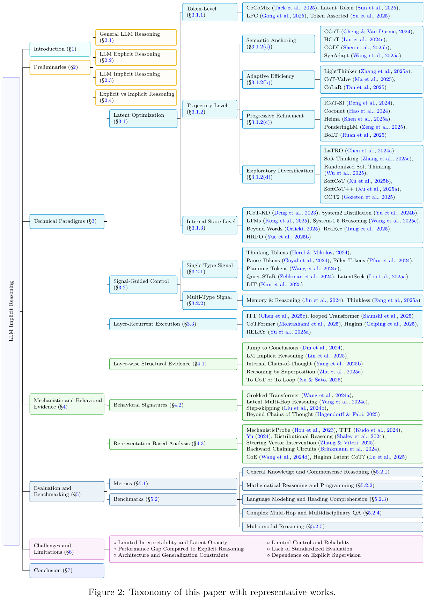

 

## 2. Preliminaries

    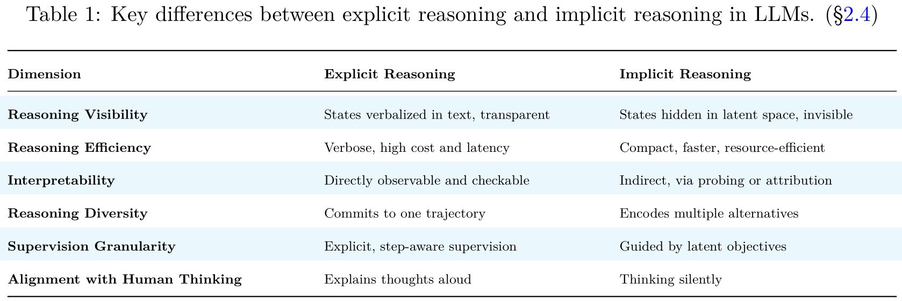

 

## 3. Technical Paradigms for Implicit Reasoning

### 3.1 Latent Optimization

#### 3.1.1 Token-Level

    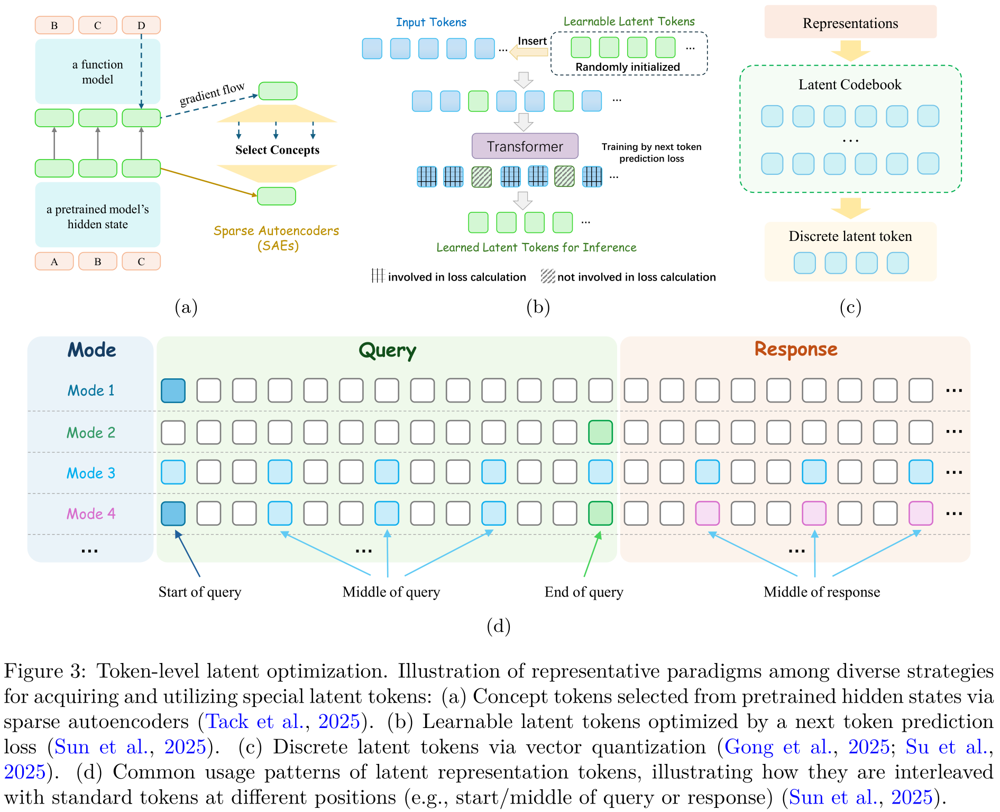

 

    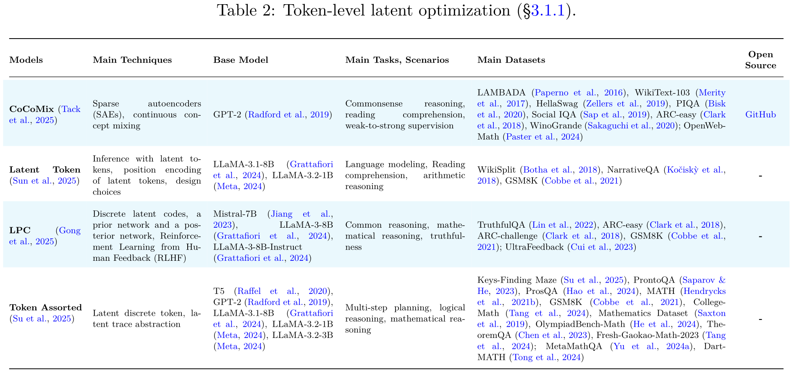

 

1. 2025_arXiv_CoCoMix_LLM Pretraining with Continuous Concepts.
   [[arXiv]](https://arxiv.org/abs/2502.08524v1)
   [[Github]](https://github.com/facebookresearch/RAM/tree/main/projects/cocomix)
   [[HuggingFace]](https://huggingface.co/papers/2502.08524)
   [[YouTube]](https://www.youtube.com/watch?v=3e-1mvDgQBI)
   [[Bilibili]](https://www.bilibili.com/video/BV1YWXGY8EPY/?vd_source=5a0ffee00ec6c37f96345e35b2838f32)
 
2. 2025_arXiv_Latent Token_Enhancing Latent Computation in Transformers with Latent Tokens.
   [[arXiv]](https://arxiv.org/abs/2505.12629)
   [[HuggingFace]](https://huggingface.co/papers/2505.12629)
   [[YouTube]](https://www.youtube.com/watch?v=h4TRfadNAFI)

3. 2025_ICML_LPC_Latent Preference Coding: Aligning Large Language Models via Discrete Latent Codes.
   [[ICML]](https://icml.cc/virtual/2025/poster/44849)
   [[arXiv]](https://arxiv.org/abs/2505.04993v1)
   
4. 2025_ICML_Token Assorted_Token Assorted: Mixing Latent and Text Tokens for Improved Language Model Reasoning.
   [[ICML]](https://icml.cc/virtual/2025/poster/44409)
   [[arXiv]](https://arxiv.org/abs/2502.03275v1)
   [[HuggingFace]](https://huggingface.co/papers/2502.03275)

#### 3.1.2 Trajectory-Level

    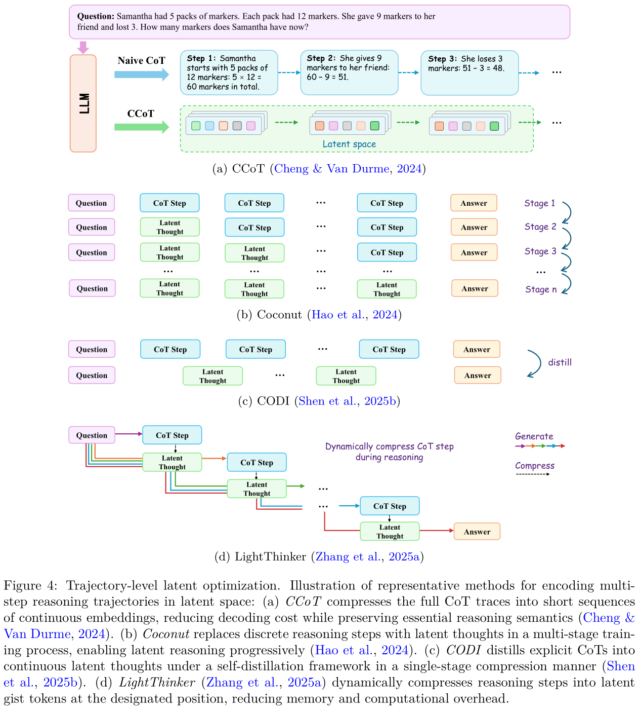

 

    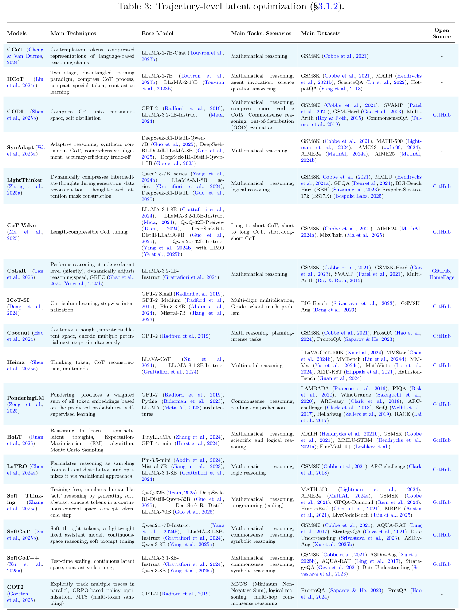

 

##### 3.1.2.1 Semantic Anchoring

1. 2024_arXiv_CCoT_Compressed Chain of Thought: Efficient Reasoning through Dense Representations.
    [[arXiv]](https://arxiv.org/abs/2412.13171)
    [[HuggingFace]](https://huggingface.co/papers/2412.13171)

2. 2024_arXiv_HCoT_Expediting and Elevating Large Language Model Reasoning via Hidden Chain-of-Thought Decoding.
    [[arXiv]](https://arxiv.org/abs/2409.08561)
    [[HuggingFace]](https://huggingface.co/papers/2409.08561)

3. 2025_arXiv_CODI_CODI: Compressing Chain-of-Thought into Continuous Space via Self-Distillation.
    [[arXiv]](https://arxiv.org/abs/2502.21074)
    [[GitHub]](https://github.com/zhenyi4/codi)
    [[HuggingFace]](https://huggingface.co/papers/2502.21074)

4. 2025_arXiv_SynAdapt_SynAdapt: Learning Adaptive Reasoning in Large Language Models via Synthetic Continuous Chain-of-Thought.
    [[arXiv]](https://arxiv.org/abs/2508.00574)

##### 3.1.2.2 Adaptive Efficiency

1. 2025_arXiv_LightThinker_LightThinker: Thinking Step-by-Step Compression.
    [[arXiv]](https://arxiv.org/abs/2502.15589)
    [[Code--Github]](https://github.com/zjunlp/LightThinker)
    [[HuggingFace]](https://huggingface.co/papers/2502.15589)
    [[YouTube]](https://www.youtube.com/watch?v=NRVBkNMnG2k)

2. 2025_arXiv_CoT-Valve_CoT-Valve: Length-Compressible Chain-of-Thought Tuning.
    [[arXiv]](https://arxiv.org/abs/2502.09601)
    [[Code--Github]](https://github.com/horseee/CoT-Valve)
    [[HuggingFace]](https://huggingface.co/papers/2502.09601)

3. 2025_arXiv_CoLaR_Think-Silently-Think-Fast=Dynamic-Latent-Compression-of-LLM-Reasoning-Chains.
   [[arXiv]](https://arxiv.org/abs/2505.16552)
   [[Homepage]](https://colar-latent-reasoning.github.io/)
   [[Github]](https://github.com/xiaomi-research/colar)

##### 3.1.2.3 Progressive Refinement

1. 2024_arXiv_ICoT-SI_From Explicit CoT to Implicit CoT: Learning to Internalize CoT Step by Step.
    [[arXiv]](https://arxiv.org/abs/2405.14838)
    [[Github]](https://github.com/sanowl/From-Explicit-CoT-to-Implicit-CoT-Learning-to-Internalize-CoT-Step-by-Step)
    [[HuggingFace]](https://huggingface.co/papers/2405.14838)
    [[YouTube]](https://www.youtube.com/live/llNI3mhg6BI)
    [[Bilibili]](https://www.bilibili.com/video/BV1WZ421M7sD/?vd_source=5a0ffee00ec6c37f96345e35b2838f32)

2. 2024_arXiv_Coconut_Training Large Language Models to Reason in a Continuous Latent Space.
    [[ICLR]](https://iclr.cc/virtual/2025/32772)
    [[arXiv]](https://arxiv.org/abs/2412.06769)
    [[Github]](https://github.com/facebookresearch/coconut)
    [[HuggingFace]](https://huggingface.co/papers/2412.06769)
    [[YouTube]](https://www.youtube.com/watch?v=mhKC3Avqy2E)

3. 2025_arXiv_Heima_Efficient Reasoning with Hidden Thinking.
    [[arXiv]](https://arxiv.org/abs/2501.19201)
    [[Code--Github]](https://github.com/shawnricecake/Heima)
    [[HuggingFace]](https://huggingface.co/papers/2501.19201)
    [[YouTube]](https://www.youtube.com/watch?v=VYhjbzN_CGw)

4. 2025_arXiv_PonderingLM_Pretraining Language Models to Ponder in Continuous Space.
    [[arXiv]](https://arxiv.org/abs/2505.20674)
    [[Github]](https://github.com/LUMIA-Group/PonderingLM)

5. 2025_arXiv_BoLT_Reasoning to Learn from Latent Thoughts.
    [[arXiv]](https://arxiv.org/abs/2503.18866)
    [[GitHub]](https://github.com/ryoungj/BoLT)
    [[HuggingFace]](https://huggingface.co/papers/2503.18866)
    [[YouTube]](https://www.youtube.com/watch?v=ON4VB6Wgqbw)

##### 3.1.2.4 Exploratory Diversification

1. 2024_arxiv_LaTRO_Unlocking Latent Reasoning Capabilities via Self-Rewarding.
    [[arXiv]](https://arxiv.org/abs/2411.04282)
    [[Github]](https://github.com/SalesforceAIResearch/LaTRO)
    [[HuggingFace]](https://huggingface.co/papers/2411.04282)

2. 2025_arXiv_Soft Thinking_Soft Thinking: Unlocking the Reasoning Potential of LLMs in Continuous Concept Space.
    [[arXiv]](https://arxiv.org/abs/2505.15778v1)
    [[HomePage]](https://soft-thinking.github.io/)
    [[Github]](https://github.com/eric-ai-lab/Soft-Thinking)
    [[HuggingFace]](https://huggingface.co/papers/2505.15778)
    [[YouTube]](https://www.youtube.com/watch?v=dgNut1AOadQ)
    [[Bilibili]](https://www.bilibili.com/video/BV1UvjzzSEKU/?vd_source=5a0ffee00ec6c37f96345e35b2838f32)

3. 2025_ACL_SoftCoT_SoftCoT: Soft Chain-of-Thought for Efficient Reasoning with LLMs.
    [[arXiv]](https://arxiv.org/abs/2502.12134)
    [[Github]](https://github.com/xuyige/SoftCoT)
    [[HuggingFace]](https://huggingface.co/papers/2502.12134)
    [[Data-HuggingFace]](https://huggingface.co/datasets/xuyige/ASDiv-Aug)

4. 2025_arXiv_SoftCoT++_SoftCoT++: Test-Time Scaling with Soft Chain-of-Thought Reasoning.
    [[arXiv]](https://arxiv.org/abs/2505.11484)
    [[Github]](https://github.com/xuyige/SoftCoT)
    [[HuggingFace]](https://huggingface.co/papers/2505.11484)

5. 2025_arXiv_CoT2_Continuous Chain of Thought Enables Parallel Exploration and Reasoning.
   [[arXiv]](https://arxiv.org/abs/2505.23648)
   [[HuggingFace]](https://huggingface.co/papers/2505.23648)

#### 3.1.3 Internal-State-Level

    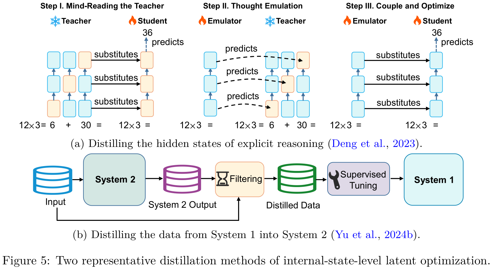

 

    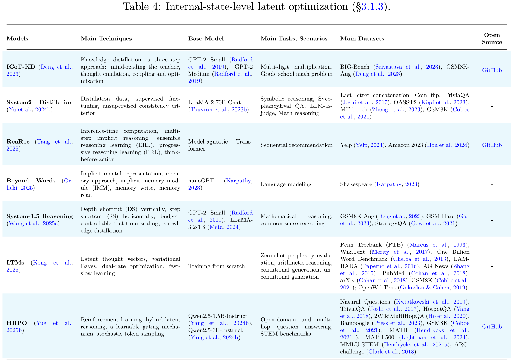

 

1. 2023_arXiv_ICoT-KD_Implicit Chain of Thought Reasoning via Knowledge Distillation.
    [[arXiv]](https://arxiv.org/abs/2311.01460)
    [[Microsoft]](https://www.microsoft.com/en-us/research/publication/implicit-chain-of-thought-reasoning-via-knowledge-distillation/)
    [[Github]](https://github.com/da03/implicit_chain_of_thought)
    [[HuggingFace]](https://huggingface.co/papers/2311.01460)
    [[YouTube]](https://www.youtube.com/watch?v=DDygkRmcxIk)

2. 2024_NeurIPS Workshop_Distilling System 2 into System 1.
    [[NeurIPS Workshop]](https://neurips.cc/virtual/2024/104303)
    [[arXiv]](https://arxiv.org/abs/2407.06023)
    [[YouTube]](https://www.youtube.com/watch?v=741gC9U9nW4)

3. 2025_arXiv_ReaRec_Think Before Recommend: Unleashing the Latent Reasoning Power for Sequential Recommendation.
    [[arXiv]](https://arxiv.org/abs/2503.22675)
    [[GitHub]](https://github.com/TangJiakai/ReaRec)
    [[HuggingFace]](https://huggingface.co/papers/2503.22675)
    [[YouTube]](https://www.youtube.com/watch?v=5i7qDcXeStU)

4. 2025_arXiv_Beyond Words_Beyond Words: A Latent Memory Approach to Internal Reasoning in LLMs.
    [[arXiv]](https://arxiv.org/abs/2502.21030)

5. 2025_arXiv_System-1.5 Reasoning_System-1.5 Reasoning: Traversal in Language and Latent Spaces with Dynamic Shortcuts.
    [[arXiv]](https://arxiv.org/abs/2505.18962)
    [[HuggingFace]](https://huggingface.co/papers/2505.18962)

6. 2025_ICML_LTMs_Scalable Language Models with Posterior Inference of Latent Thought Vectors.
   [[ICML]](https://icml.cc/virtual/2025/poster/43587)
   [[arXiv]](https://arxiv.org/abs/2502.01567)
   [[Homepage]](https://deqiankong.github.io/blogs/ltm/)
   [[HuggingFace]](https://huggingface.co/papers/2502.01567)   

7. 2025_arXiv_HRPO_Hybrid Latent Reasoning via Reinforcement Learning.
    [[arXiv]](https://arxiv.org/abs/2505.18454)
    [[Github]](https://github.com/skywalker-hub/HRPO1)
    [[HuggingFace]](https://huggingface.co/papers/2505.18454)

### 3.2 Signal-Guided Control

    

 

#### 3.2.1 Single-Type Signal

1. 2024_arXiv_thinking-tokens_Thinking Tokens for Language Modeling.
    [[arXiv]](https://arxiv.org/abs/2405.08644)
    [[HuggingFace]](https://huggingface.co/papers/2405.08644)

2. 2024_ICLR_pause-token_Think Before You Speak: Training Language Models with Pause Tokens.
    [[ICLR]](https://iclr.cc/virtual/2024/poster/17771)
    [[arXiv]](https://arxiv.org/abs/2310.02226)
    [[HuggingFace]](https://huggingface.co/papers/2310.02226)
    [[YouTube]](https://www.youtube.com/watch?v=MtJ1jacr_yI)

3. 2024_COLM_Quiet-STaR_Quiet-STaR: Language Models Can Teach Themselves to Think Before Speaking.
    [[CoLM--OpenReview]](https://openreview.net/forum?id=oRXPiSOGH9#discussion)
    [[arXiv]](https://arxiv.org/abs/2403.09629)
    [[Github]](https://github.com/ezelikman/quiet-star)
    [[HuggingFace]](https://huggingface.co/papers/2403.09629)
    [[YouTube]](https://www.youtube.com/watch?v=I78o3_lxXaQ)

   
4. 2024_CoLM_FillerTokens_Let's Think Dot by Dot: Hidden Computation in Transformer Language Models.
    [[CoLM--OpenReview]](https://openreview.net/forum?id=NikbrdtYvG#discussion)
    [[arXiv]](https://arxiv.org/abs/2404.15758)
    [[GitHub]](https://github.com/jacobpfau/fillertokens)
    [[HuggingFace]](https://huggingface.co/papers/2404.15758)
    [[YouTube]](https://www.youtube.com/watch?v=AIR9QduDqD8)

5. 2024_CoLM_planning-tokens_Guiding Language Model Reasoning with Planning Tokens.
    [[CoLM--OpenReview]](https://openreview.net/forum?id=wi9IffRhVM)
    [[arXiv]](https://arxiv.org/abs/2310.05707)
    [[Microsoft]](https://www.microsoft.com/en-us/research/publication/guiding-language-model-reasoning-with-planning-tokens/)
    [[Github]](https://github.com/WANGXinyiLinda/planning_tokens)

6. 2025_arXiv_LatentSeek_Seek in the Dark: Reasoning via Test-Time Instance-Level Policy Gradient in Latent Space.
    [[arXiv]](https://arxiv.org/abs/2505.13308v1)
    [[HomePage]](https://bigai-nlco.github.io/LatentSeek/)
    [[Github]](https://github.com/bigai-nlco/LatentSeek)
    [[HuggingFace]](https://huggingface.co/papers/2505.13308)

7. 2025_ACL_DIT_Learning to Insert [PAUSE] Tokens for Better Reasoning.
    [[arXiv]](https://arxiv.org/abs/2506.03616)
    [[Github]](https://github.com/xfactlab/acl2025-dit)

#### 3.2.2 Multi-Type Signal

1. 2025_ACL_Memory-Reasoning_Disentangling-Memory-and-Reasoning-Ability-in-Large-Language-Models.
    [[arXiv]](https://arxiv.org/abs/2411.13504)
    [[Github]](https://github.com/MingyuJ666/Disentangling-Memory-and-Reasoning)

2. 2025_arXiv_Thinkless_Thinkless: LLM Learns When to Think.
    [[arXiv]](https://arxiv.org/abs/2505.13379)
    [[Github]](https://github.com/VainF/Thinkless)
    

### 3.3 Layer-Recurrent Execution

    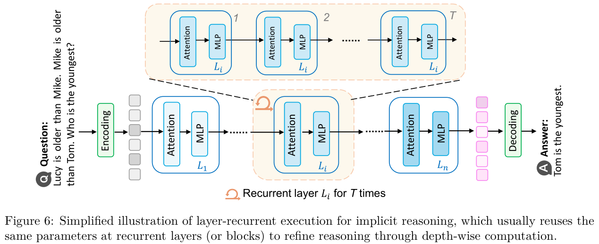

 

    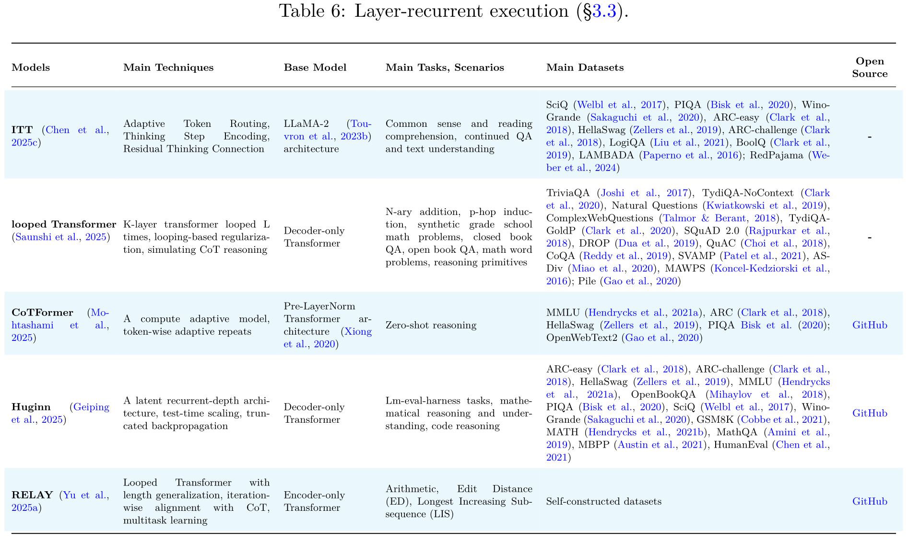

 

1. 2025_arXiv_ITT_Inner Thinking Transformer: Leveraging Dynamic Depth Scaling to Foster Adaptive Internal Thinking.
    [[arXiv]](https://arxiv.org/abs/2502.13842)
    [[HuggingFace]](https://huggingface.co/papers/2502.13842)
    [[YouTube]](https://www.youtube.com/watch?v=drbIAHOJiDc)

2. 2025_ICLR_looped-Transformer_Reasoning with Latent Thoughts: On the Power of Looped Transformers.
    [[arXiv]](https://arxiv.org/abs/2502.17416)
    [[ICLR]](https://iclr.cc/virtual/2025/poster/28971)
    [[Poster]](https://iclr.cc/media/iclr-2025/Slides/28971.pdf)
    [[Youtube]](https://www.youtube.com/watch?v=S22Bs07HD0k)

3. 2025_ICLR_CoTFormer_CoTFormer: A Chain-of-Thought Driven Architecture with Budged-Adaptive Computation Cost at Inference.
    [[NeurIPS Workshop]](https://openreview.net/pdf?id=rBgo4Mi8vZ)
    [[ICLR]](https://iclr.cc/virtual/2025/poster/30808)
    [[arXiv]](https://arxiv.org/abs/2310.10845)
    [[Github]](https://github.com/epfml/cotformer)

   
4. 2025_arXiv_Huginn_Scaling up Test-Time Compute with Latent Reasoning: A Recurrent Depth Approach.
    [[arXiv]](https://arxiv.org/abs/2502.05171)
    [[HuggingFace]](https://huggingface.co/tomg-group-umd/huginn-0125)
    [[Github]](https://github.com/seal-rg/recurrent-pretraining)
    [[YouTube]](https://www.youtube.com/watch?v=-ZTXnQhH0PQ)

   
5. 2025_arXiv_RELAY_Enhancing Auto-regressive Chain-of-Thought through Loop-Aligned Reasoning.
    [[arXiv]](https://arxiv.org/abs/2502.08482)
    [[GitHub]](https://github.com/qifanyu/RELAY)

   

## 4. Mechanistic and Behavioral Evidence

### 4.1 Layer-wise Structural Evidence

1. 2024_LREC-COLING_Jump to Conclusions: Short-Cutting Transformers with Linear Transformations.
    [[ACL-LREC-COLING]](https://aclanthology.org/2024.lrec-main.840/)
    [[arXiv]](https://arxiv.org/abs/2303.09435)
    [[Github]](https://github.com/sashayd/mat)
    [[HuggingFace]](https://huggingface.co/papers/2303.09435)

2. 2025_arXiv_LM Implicit Reasoning_Implicit Reasoning in Transformers is Reasoning through Shortcuts.
    [[arXiv]](https://arxiv.org/abs/2503.07604)
    [[Github]](https://github.com/TianheL/LM-Implicit-Reasoning)
    [[HuggingFace]](https://huggingface.co/papers/2503.07604)
   
3. 2025_arXiv_Internal Chain-of-Thought: Empirical Evidence for Layer-wise Subtask Scheduling in LLMs.
    [[arXiv]](https://arxiv.org/abs/2505.14530)
    [[GitHub]](https://github.com/yzp11/internal-chain-of-thought)

   
4. 2025_arXiv_Reasoning by Superposition: A Theoretical Perspective on Chain of Continuous Thought.
    [[arXiv]](https://arxiv.org/abs/2505.12514)
    
5. 2025_arXiv_To CoT or To Loop? A Formal Comparison Between Chain-of-Thought and Looped Transformers.
    [[arXiv]](https://arxiv.org/abs/2505.19245)

### 4.2 Behavioral Signatures
   
1. 2024_NeurIPS_Grokked Transformer_Grokked Transformers are Implicit Reasoners: A Mechanistic Journey to the Edge of Generalization.
    [[ICML Workshop--OpenReview]](https://openreview.net/forum?id=ns8IH5Sn5y)
    [[NeurIPS]](https://proceedings.neurips.cc/paper_files/paper/2024/hash/ad217e0c7fecc71bdf48660ad6714b07-Abstract-Conference.html)
    [[arXiv]](https://arxiv.org/abs/2405.15071)
    [[Github]](https://github.com/OSU-NLP-Group/GrokkedTransformer)
    [[HuggingFace]](https://huggingface.co/papers/2405.15071)
    [[YouTube]](https://www.youtube.com/watch?v=qYcLhPnPezU)

2. 2024_ACL_latent multi-hop reasoning_Do Large Language Models Latently Perform Multi-Hop Reasoning.
    [[ACL]](https://aclanthology.org/2024.acl-long.550/)
    [[arXiv]](https://arxiv.org/abs/2402.16837)
    [[Github]](https://github.com/google-deepmind/latent-multi-hop-reasoning)
    [[HuggingFace]](https://huggingface.co/datasets/soheeyang/TwoHopFact)

3. 2024_NeurIPS_step-skipping_Can Language Models Learn to Skip Steps.
    [[NeurIPS]](https://proceedings.neurips.cc/paper_files/paper/2024/hash/504fa7e518da9d1b53a233ed20a38b46-Abstract-Conference.html)
    [[ACM NeurIPS]](https://dl.acm.org/doi/10.5555/3737916.3739357)
    [[arXiv]](https://arxiv.org/abs/2411.01855v1)
    [[Github]](https://github.com/tengxiaoliu/LM_skip)
    [[HuggingFace]](https://huggingface.co/papers/2411.01855)
   
4. 2025_arXiv_Beyond Chains of Thought: Benchmarking Latent-Space Reasoning Abilities in Large Language Models.
    [[arXiv]](https://arxiv.org/abs/2504.10615)
    [[HuggingFace]](https://huggingface.co/papers/2504.10615)
   

### 4.3 Representation-Based Probing

1. 2023_EMNLP_MechanisticProbe_Towards a Mechanistic Interpretation of Multi-Step Reasoning Capabilities of Language Models.
    [[EMNLP]](https://aclanthology.org/2023.emnlp-main.299/)
    [[arXiv]](https://arxiv.org/abs/2310.14491)
    [[Github]](https://github.com/yifan-h/mechanisticprobe)
    [[HuggingFace]](https://huggingface.co/papers/2310.14491)

2. 2024_arXiv_TTT_Think-to-Talk or Talk-to-Think: When LLMs Come Up with an Answer in Multi-Step Arithmetic Reasoning.
    [[arXiv]](https://arxiv.org/abs/2412.01113)
    [[GitHub]](https://github.com/keitokudo/TTT)

3. 2024_arXiv_Do LLMs Really Think Step-by-Step in Implicit Reasoning.
    [[arXiv]](https://arxiv.org/abs/2411.15862)
    [[GitHub]](https://github.com/yuyijiong/if_step_by_step_implicit_cot)

4. 2024_arXiv_Distributional Reasoning_Distributional Reasoning in LLMs: Parallel Reasoning Processes in Multi-Hop Reasoning.
    [[arXiv]](https://arxiv.org/abs/2406.13858)
    [[YouTube 1]](https://www.youtube.com/watch?v=tFcz-aTBqG0)
    [[YouTbue 2]](https://www.youtube.com/watch?v=SNw-Gh1LRFQ)
   
5. 2024_ACL_backward chaining circuits_A Mechanistic Analysis of a Transformer Trained on a Symbolic Multi-Step Reasoning Task.
    [[ACL]](https://aclanthology.org/2024.findings-acl.242/)
    [[arXiv]](https://arxiv.org/abs/2402.11917v3)
    [[GitHub]](https://github.com/abhay-sheshadri/backward-chaining-circuits)
    [[HuggingFace]](https://huggingface.co/papers/2402.11917)
   
6. 2025_ICLR Workshop_steering vector intervention_Uncovering Latent Chain of Thought Vectors in Large Language Models.
    [[ICLR Workshop]](https://iclr.cc/virtual/2025/33087)
    [[arXiv]](https://arxiv.org/abs/2409.14026)
   
7. 2025_ICLR_CoE_Latent Space Chain-of-Embedding Enables Output-free LLM Self-Evaluation.
    [[ICLR]](https://iclr.cc/virtual/2025/poster/28606)
    [[arXiv]](https://arxiv.org/abs/2410.13640)
    [[Github]](https://github.com/Alsace08/Chain-of-Embedding)

## 5. Evaluation Methods and Benchmarks

### 5.1 Metrics

### 5.2 Benchmarks

#### 5.2.1 General Knowledge and Commonsense Reasoning Benchmarks

    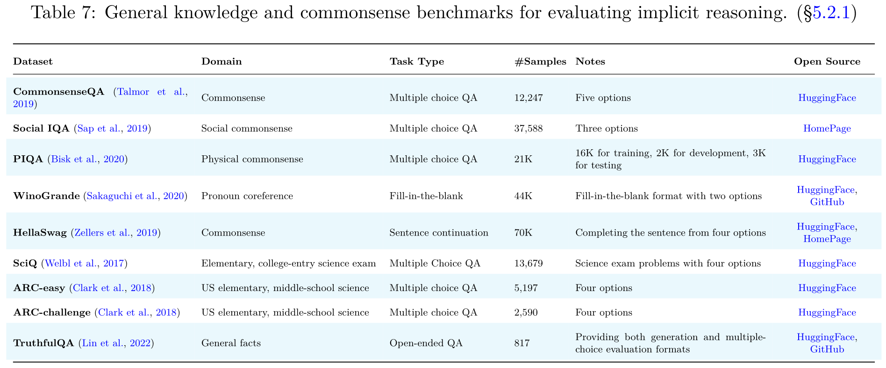

 

#### 5.2.2 Mathematical Reasoning and Programming Benchmarks

    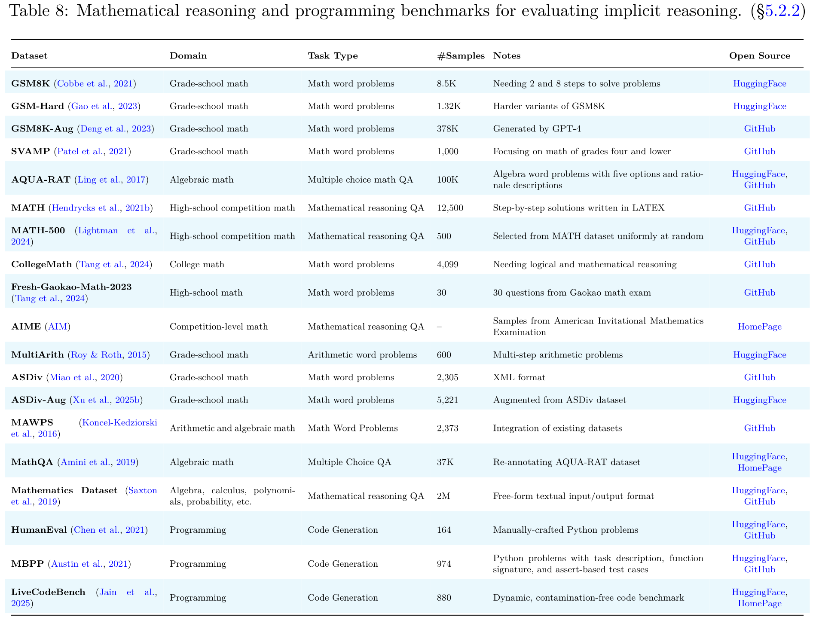

 

#### 5.2.3 Language Modeling and Reading Comprehension Benchmarks

    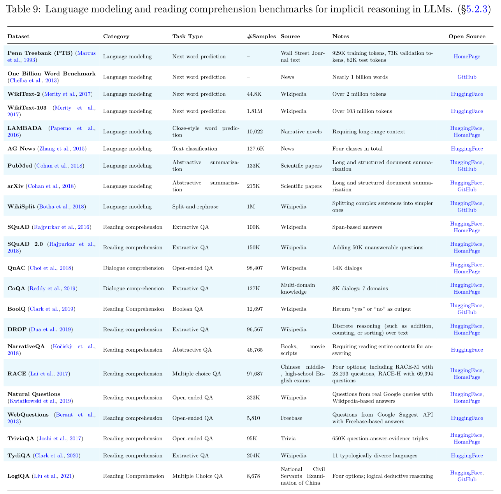

 

#### 5.2.4 Complex Multi-hop and Multidisciplinary QA Benchmarks

    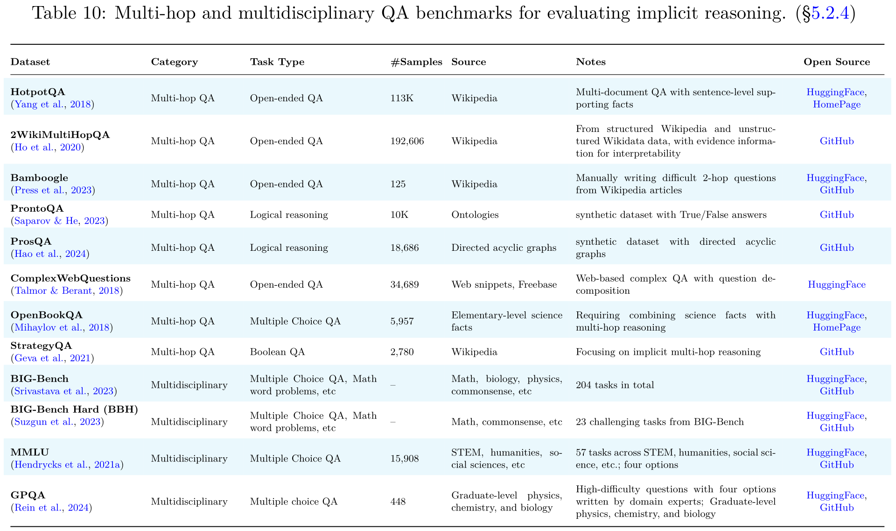

 

#### 5.2.5 Multi-modal Reasoning Benchmarks

    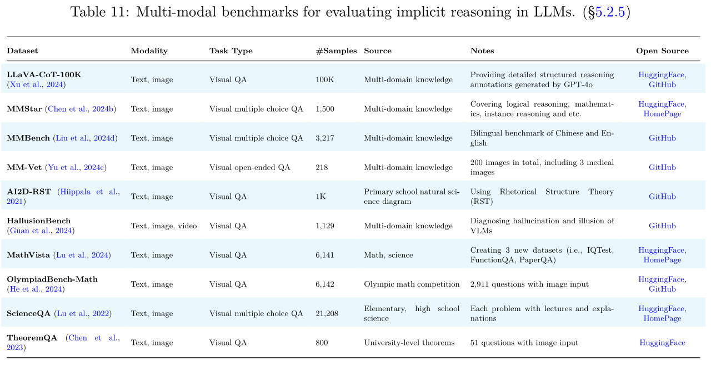

 

## Related Survey

### Reasoning

1. 2023_arXiv_Survey_A Survey of Reasoning with Foundation Model.
   [[arXiv]](https://arxiv.org/abs/2312.11562)
   [[Github]](https://github.com/reasoning-survey/Awesome-Reasoning-Foundation-Models)

2. 2024_EACL_Survey_Large Language Models for Mathematical Reasoning: Progresses and Challenges.
   [[ACL]](https://aclanthology.org/2024.eacl-srw.17/)
   [[arXiv]](https://arxiv.org/abs/2402.00157)

3. 2025_arXiv_Survey_Reinforced MLLM: A Survey on RL-Based Reasoning in Multimodal Large Language Models.
   [[arXiv]](https://arxiv.org/abs/2504.21277)

4. 2025_arXiv_Survey_Towards Reasoning Era: A Survey of Long-Chain-of-Thought for Reasoning Large Language Models.
   [[arXiv]](https://arxiv.org/abs/2503.09567)
   [[Github]](https://github.com/LightChen233/Awesome-Long-Chain-of-Thought-Reasoning)
   [[Homepage]](https://long-cot.github.io/)

5. 2025_arXiv_Survey_From System 1 to System 2: A Survey of Reasoning Large Language Models.
    [[arXiv]](https://arxiv.org/abs/2502.17419)
    [[Github]](https://github.com/zzli2022/Awesome-System2-Reasoning-LLM)

6. 2025_arXiv_Survey_Thinking with Images for Multimodal Reasoning= Foundations, Methods, and Future Frontiers
    [[arXiv]](https://arxiv.org/abs/2506.23918)
    [[Github]](https://github.com/zhaochen0110/Awesome_Think_With_Images)

### Efficient Reasoning

1. 2025_arXiv_Survey_A Survey of Efficient Reasoning for Large Reasoning Models: Language, Multimodality, and Beyond.
   [[arXiv]](https://arxiv.org/abs/2503.21614)
   [[Github]](https://github.com/XiaoYee/Awesome_Efficient_LRM_Reasoning)
 
2. 2025_arXiv_Survey_Efficient Inference for Large Reasoning Models: A Survey.
   [[arXiv]](https://arxiv.org/abs/2503.23077)
   [[Github]](https://github.com/yueliu1999/Awesome-Efficient-Inference-for-LRMs)
 
3. 2025_arXiv_Survey_Efficient Reasoning Models: A Survey.
   [[arXiv]](https://arxiv.org/abs/2504.10903)
   [[Github]](https://github.com/fscdc/Awesome-Efficient-Reasoning-Models)
 
4. 2025_arXiv_Survey_Harnessing the Reasoning Economy: A Survey of Efficient Reasoning for Large Language Models.
   [[arXiv]](https://arxiv.org/abs/2503.24377)
   [[Github]](https://github.com/DevoAllen/Awesome-Reasoning-Economy-Papers)
 
5. 2025_arXiv_Survey_Stop Overthinking: A Survey on Efficient Reasoning for Large Language Models.
   [[arXiv]](https://arxiv.org/abs/2503.16419)
   [[Github]](https://github.com/Eclipsess/Awesome-Efficient-Reasoning-LLMs)

6. 2025_arXiv_Survey_Don't Overthinking It: A Survey of Efficient R1-style Large Reasoning Models.
   [[arXiv]](https://arxiv.org/abs/2508.02120)
   [[Github]](https://github.com/yuelinan/Awesome-Efficient-R1-style-LRMs)

   
### Latent Reasoning
 
1. 2025_arXiv_Survey_Reasoning Beyond Language: A Comprehensive Survey on Latent Chain-of-Thought Reasoning.
    [[arXiv]](https://arxiv.org/abs/2505.16782)
    [[Github]](https://github.com/EIT-NLP/Awesome-Latent-CoT)

2. 2025_arXiv_Survey_A Survey on Latent Reasoning.
   [[arXiv]](https://arxiv.org/pdf/2507.06203v1)
   [[Github]](https://github.com/multimodal-art-projection/LatentCoT-Horizon/)

## Related Reposority

### Reasoning

1. The-Martyr / Awesome-Multimodal-Reasoning.
   [[Github]](https://github.com/The-Martyr/Awesome-Multimodal-Reasoning)

2. atfortes / Awesome-LLM-Reasoning
   [[GitHub]](https://github.com/atfortes/Awesome-LLM-Reasoning)

### Efficient Reasoning

1. hemingkx / Awesome-Efficient-Reasoning.
   [[Github]](https://github.com/hemingkx/Awesome-Efficient-Reasoning)
   
2. Blueyee / Efficient-CoT-LRMs.
   [[Github]](https://github.com/Blueyee/Efficient-CoT-LRMs)

3. Hongcheng-Gao / Awesome-Long2short-on-LRMs.
   [[Github]](https://github.com/Hongcheng-Gao/Awesome-Long2short-on-LRMs)

4. zcccccz / Awesome-LLM-Implicit-Reasoning.
   [[Github]](https://github.com/zcccccz/Awesome-LLM-Implicit-Reasoning)

5. zzli2022 / Awesome-System2-Reasoning-LLM
   [[Github]](https://github.com/zzli2022/Awesome-System2-Reasoning-LLM)

## 📖 Citation

